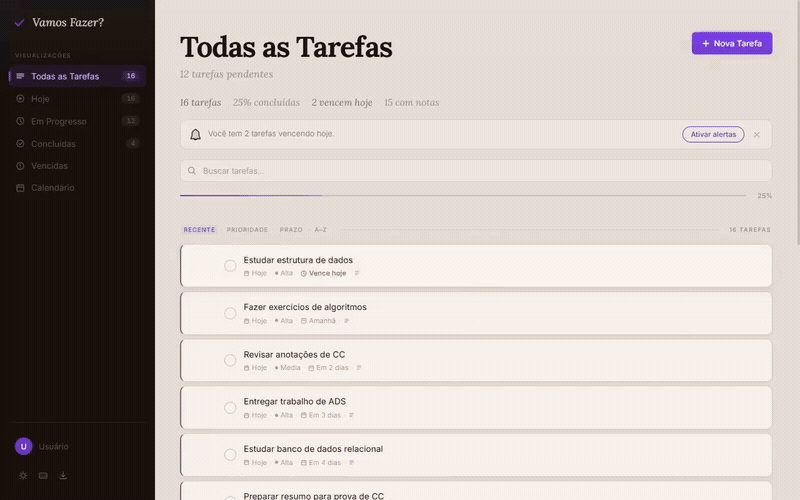
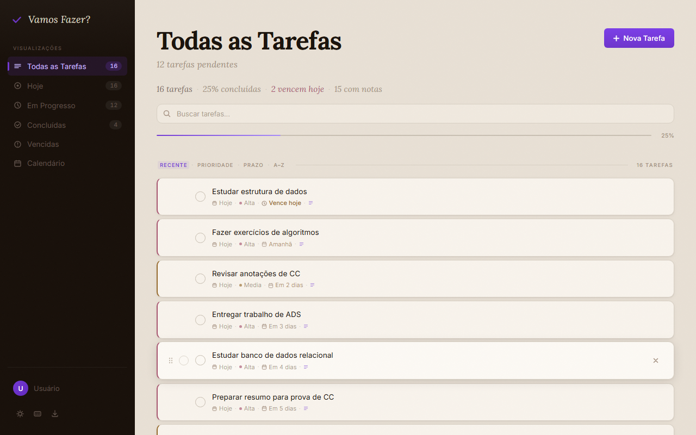
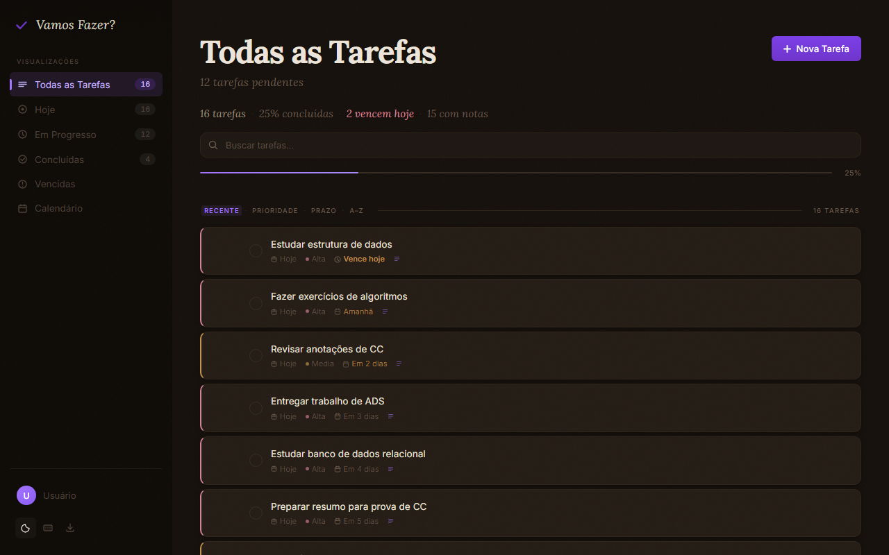
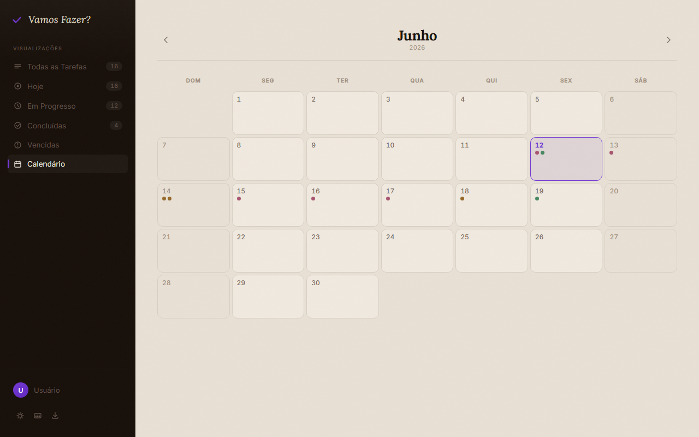
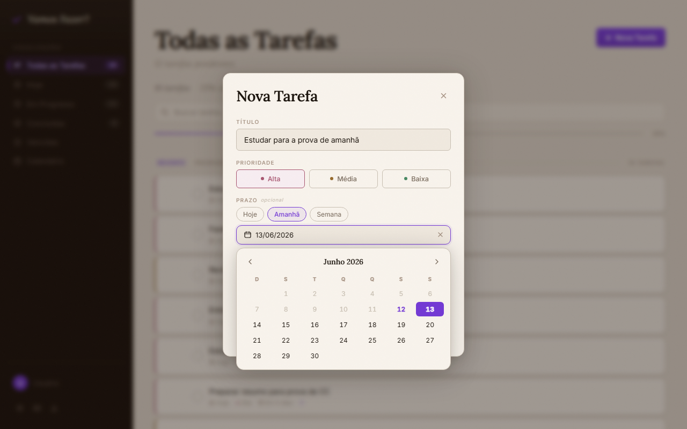
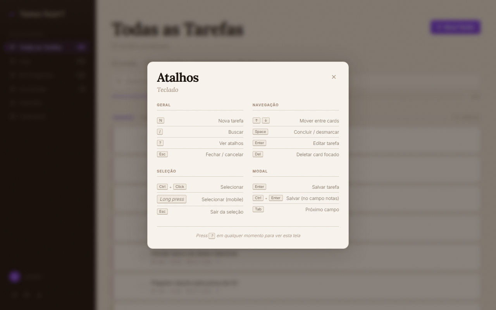
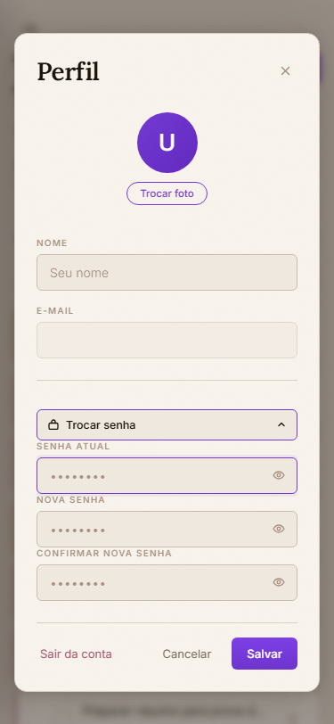

<!-- BANNER -->
<div align="center">
  
</div>

<br />

<!-- HERO GIF -->
<div align="center">
  
</div>

<br />

<!-- TYPING ANIMATION -->
<div align="center">
  <a href="https://vamos-fazer.vercel.app/">
    
  </a>
</div>

<br />

<!-- BADGES -->
<div align="center">


</div>

<br />

<!-- CTA -->
<div align="center">

[](https://vamos-fazer.vercel.app/)

</div>

<br />

---

## 📋 Sumário

- [Sobre o Projeto](#-sobre-o-projeto)
- [Demonstração](#-demonstração)
- [Funcionalidades](#-funcionalidades)
- [Tecnologias](#️-tecnologias)
- [Arquitetura](#️-arquitetura)
- [Estrutura do Projeto](#-estrutura-do-projeto)
- [Desafios e Decisões Técnicas](#-desafios-e-decisões-técnicas)
- [Autor](#-autor)

---

## 📖 Sobre o Projeto

**Vamos Fazer?** é um gerenciador de tarefas pessoal com interface editorial e minimalista. Funciona como aplicação web instalável (PWA), opera offline e sincroniza entre dispositivos quando o usuário está autenticado.

O projeto nasceu como exercício acadêmico, já que a faculdade exigia JavaScript puro sem frameworks. Com o tempo, cresceu até virar uma ferramenta que o autor usa no dia a dia. Hoje está finalizado e serve também como peça de portfólio.

A aplicação suporta três modos de uso:

- **Autenticado**: login com e-mail e senha via Supabase, com tarefas sincronizadas entre dispositivos em tempo real.
- **Local**: funciona apenas com `localStorage`, sem necessidade de conta.
- **Visitante**: entra direto na tela inicial com 16 tarefas de demonstração, sem cadastro.

---

## 🎬 Demonstração

### Tema claro e escuro

<table>
  <tr>
    <td width="50%"></td>
    <td width="50%"></td>
  </tr>
</table>

### Outras telas

<table>
  <tr>
    <td width="50%" align="center">
      
      <br />
      <sub>Calendário mensal com pontos coloridos por prioridade</sub>
    </td>
    <td width="50%" align="center">
      
      <br />
      <sub>Datepicker customizado, construído do zero</sub>
    </td>
  </tr>
  <tr>
    <td width="50%" align="center">
      
      <br />
      <sub>Overlay de atalhos de teclado</sub>
    </td>
    <td width="50%" align="center">
      
      <br />
      <sub>Layout responsivo no mobile</sub>
    </td>
  </tr>
</table>

---

## ✨ Funcionalidades

<details>
<summary><b>📝 Gestão de tarefas</b></summary>
<br />

- Criar tarefa com título (até 120 caracteres, com contador visual), prioridade (Alta/Média/Baixa), prazo opcional e notas opcionais (até 1.000 caracteres)
- Editar qualquer tarefa existente no mesmo modal, com título e botão se adaptando ao contexto
- Marcar e desmarcar conclusão com animação
- Deletar com confirmação em dois cliques, e botão **Desfazer** por 5 segundos via toast
- Reordenação por drag & drop no desktop (ordenação "Recente" sem busca ativa)

</details>

<details>
<summary><b>🗂 Visualizações e filtros</b></summary>
<br />

- **Todas as Tarefas**: view padrão
- **Hoje**: tarefas criadas hoje
- **Em Progresso**: não concluídas
- **Concluídas**
- **Vencidas**: não concluídas com prazo já vencido
- **Calendário**: visualização mensal

Cada filtro tem badge com contagem em tempo real na sidebar. Ordenação por Recente, Prioridade, Prazo ou A–Z. Busca em tempo real com debounce de 180ms e destaque visual do termo encontrado.

</details>

<details>
<summary><b>📅 Calendário</b></summary>
<br />

- Grid mensal com nomes dos dias da semana em português
- Pontos coloridos no dia de cada tarefa (cor pela prioridade; opacidade reduzida se concluída; máximo 3 pontos + indicador `+N`)
- Dia atual destacado, fins de semana com estilo próprio
- Navegação por mês com botão **Hoje** que aparece quando aplicável
- Clique em ponto abre a edição da tarefa
- Clique em célula vazia abre o modal já com a data preenchida

</details>

<details>
<summary><b>⌨️ Produtividade</b></summary>
<br />

**Atalhos de teclado**

| Atalho | Ação |
|---|---|
| `N` | Nova tarefa |
| `/` | Focar busca |
| `?` | Ver atalhos |
| `Esc` | Fechar / cancelar |
| `↑` `↓` | Navegar entre cards |
| `Space` | Concluir / desmarcar card focado |
| `Enter` | Editar card focado |
| `Del` | Deletar card focado |
| `Ctrl` + `Click` | Selecionar (desktop) |
| `Long press` | Selecionar (mobile) |
| `Ctrl` + `Enter` | Salvar (no campo notas) |

- **Seleção em lote**: barra fixa inferior com **Selecionar Todas**, **Concluir** e **Deletar**
- **Datepicker customizado** com presets **Hoje** / **Amanhã** / **Semana**
- **Indicador de força de senha** no cadastro (5 níveis com cores)

</details>

<details>
<summary><b>🔐 Autenticação e sincronização</b></summary>
<br />

- Login e cadastro por e-mail/senha via **Supabase Auth**
- Confirmação de e-mail no cadastro
- Recuperação de senha por link enviado por e-mail
- Reenviar e-mail de confirmação
- Mensagens de erro traduzidas para português
- Toggle de visibilidade da senha
- Perfil editável (nome, avatar como foto em base64, e troca de senha com reautenticação)
- **Sincronização em tempo real** entre dispositivos via Supabase Realtime

</details>

<details>
<summary><b>📲 PWA e offline-first</b></summary>
<br />

- Aplicação instalável (manifest + service worker)
- Funciona totalmente offline para operações locais
- Fila de operações pendentes em `localStorage` (`vf-fila-sync`) que dá flush automático quando volta o online
- Service Worker com estratégia `stale-while-revalidate` para assets locais; requisições para Supabase sempre passam pela rede com fallback `503` JSON quando offline
- Notificações nativas para tarefas vencendo hoje (uma vez por dia)

</details>

<details>
<summary><b>📥 Importação e exportação</b></summary>
<br />

- **Exportar backup JSON** com versão, data de exportação e lista completa de tarefas
- **Exportar planilha CSV** com BOM UTF-8 (abre direto no Excel sem quebrar acentos)
- **Importar JSON** com preview do conteúdo e opção de **Mesclar** (evita duplicidade por ID) ou **Substituir**

</details>

<details>
<summary><b>♿ Acessibilidade</b></summary>
<br />

- Atributos ARIA em todos os componentes interativos (`role`, `aria-label`, `aria-pressed`, `aria-expanded`, `aria-current`)
- Focus trap em todos os modais (tarefa, importação, atalhos, perfil)
- Região com `aria-live="polite"` anuncia criações, conclusões e exclusões para leitores de tela
- Navegação por teclado cobre 100% das operações
- Respeita `prefers-color-scheme` e `prefers-reduced-motion`
- Foco visível com `outline` em todos os elementos focáveis

</details>

---

## 🛠️ Tecnologias

<div align="center">

[](https://skillicons.dev)

</div>

### Stack

| Categoria | Ferramentas |
|---|---|
| **Frontend** | HTML5, CSS3 (custom properties + BEM), JavaScript ES5 (sem build, sem framework, sem bundler) |
| **Tipografia** | [Lora](https://fonts.google.com/specimen/Lora) (display, serifa) · [Inter](https://fonts.google.com/specimen/Inter) (corpo) |
| **Backend / BaaS** | [Supabase](https://supabase.com): Auth + Postgres + Realtime |
| **APIs Web nativas** | Service Worker, Web App Manifest, Notification API, Drag & Drop, File API, Vibration API, LocalStorage |
| **Deploy** | [Vercel](https://vercel.com): produção e preview |

---

## 🏗️ Arquitetura

A aplicação é uma **SPA estática sem build step**: nenhum bundler, transpilador ou gerenciador de pacotes. HTML, CSS e JavaScript "vanilla" servidos diretamente, com o SDK do Supabase carregado via CDN.

### Modularização

O JavaScript é dividido em três namespaces globais, cada um com responsabilidade clara:

```
window.Auth   →  Tela de login/cadastro/recuperação, sessão e estado de auth
window.Sync   →  CRUD com Supabase, fila offline, canal Realtime
script.js     →  Estado global, renderização, eventos, calendário, atalhos
```

### Camada de persistência

Estratégia **offline-first em camadas**:

1. Toda mutação é gravada primeiro em `localStorage`
2. Em paralelo, dispara `upsert` ou `delete` no Supabase
3. Se offline ou sem usuário, a operação vai para fila local (`vf-fila-sync`)
4. Evento `window.online` processa a fila automaticamente
5. Canal Realtime do Supabase recarrega tudo quando recebe mudança de outro dispositivo

### Service Worker

Duas estratégias paralelas:

- **Assets locais** (HTML, CSS, JS, ícone, manifest) → `stale-while-revalidate`
- **Domínios externos** (Supabase, Google Fonts, jsdelivr) → sempre rede, com fallback `503` JSON quando offline

### Tema sem flash

A escolha de tema (claro/escuro) é aplicada **antes** do CSS carregar, via snippet inline no `<head>` que lê o `localStorage` e o `prefers-color-scheme` e seta o atributo `data-theme` no `<html>`. Todas as variáveis CSS dependem desse atributo.

---

## 📁 Estrutura do Projeto

```
.
├── assets/
│   ├── demo/
│   │   └── vamos-fazer-demo.gif    Demonstração animada usada no README
│   └── screenshots/                Imagens estáticas usadas no README
├── css/
│   └── style.css                   Estilo único, ~780 linhas, BEM + custom properties
├── js/
│   ├── auth.js                     window.Auth, autenticação e tela de login
│   ├── script.js                   Estado, renderização e eventos (~2.200 linhas)
│   └── sync.js                     window.Sync, CRUD Supabase, fila offline, realtime
├── icon.svg                        Ícone do PWA
├── index.html                      UI declarativa + configuração do cliente Supabase
├── manifest.json                   Manifest do PWA (pt-BR, standalone)
├── sw.js                           Service Worker
└── README.md
```

---

## 🧩 Desafios e Decisões Técnicas

### Construir sem framework

A faculdade pediu JavaScript puro. Sem framework, toda a renderização é imperativa, com troca de view feita injetando `innerHTML` no `#main-content`, sem virtual DOM. A sincronização entre estado e UI é manual em cada operação, exigindo disciplina pra não esquecer de atualizar badges, contadores e barra de progresso a cada mudança. Cada função de mutação termina chamando um `sincronizarEstado()` central.

### Offline-first com fila de sincronização

A escolha foi salvar **sempre** localmente primeiro e tratar o Supabase como camada secundária. Toda operação que falha (offline ou erro) entra na fila `vf-fila-sync` em `localStorage`. Quando o `window.online` dispara, a fila é processada em ordem; operações que continuam falhando voltam pra fila. Resultado: operações offline são preservadas e replicadas no servidor assim que a conexão volta.

### Sincronização em tempo real entre dispositivos

Cada usuário autenticado abre um canal Realtime no Supabase filtrado por `user_id`. Qualquer mudança em outro dispositivo dispara um recarregamento completo da lista. A lógica é simples por design: recarregar tudo é mais robusto que tentar fazer merge incremental e lidar com conflitos de ordem.

### Datepicker customizado

O input nativo `<input type="date">` tem visual inconsistente entre navegadores e destoa da estética editorial do app. A solução foi construir um picker próprio: popup com navegação por mês, presets rápidos (**Hoje** / **Amanhã** / **Semana**) e botão para limpar prazo. Mais código, mas comportamento idêntico em todos os navegadores e visual coerente com o resto da UI.

### Acessibilidade

Atributos ARIA em todos os componentes interativos. Os quatro modais (tarefa, importação, atalhos, perfil) implementam focus trap próprio. Uma região com `aria-live="polite"` anuncia criações, conclusões e exclusões. A navegação por teclado cobre todas as operações: criar, editar, deletar, navegar, selecionar em lote, alternar tema, buscar, abrir atalhos.

---

## 👤 Autor

<div align="center">
  <br />
  <a href="https://github.com/Xturzin">
    
  </a>
  <br />
  <br />
  <b>Arthur Couto</b>
  <br />
  <br />
  
  [](https://github.com/Xturzin)
  [](https://www.linkedin.com/in/arthurcoutooliveira)
  [](https://www.instagram.com/xtruzin/)

</div>

<br />

<!-- FOOTER WAVE -->

